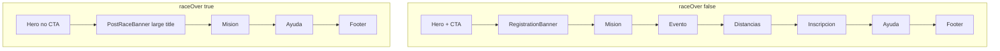

# Post-race thank-you landing (`raceOver`)

## Current state

- [`config/race.yaml`](config/race.yaml) already has `raceOver` and `raceOverMessage`.
- [`app/page.tsx`](app/page.tsx): when `raceOver`, the registration stripe is **replaced** by a simpler `bg-accent` block showing only `raceOverMessage` at `text-2xl md:text-3xl`; **Evento**, **Distancias**, and **Inscripción** still render ([`InscripcionSection`](app/components/InscripcionSection.tsx) switches to “closed” UI).
- [`Hero.tsx`](app/components/Hero.tsx): already hides the CTA and the capacity note when `raceOver`.
- [`Nav.tsx`](app/components/Nav.tsx): already hides **Inscripción** nav link and the “Inscríbete” button when `raceOver`, but still shows **Evento** and **Distancias** (which would be dead anchors if those sections are removed).

## Target behavior (single YAML toggle)

Use **`raceOver: true`** as the one switch (no second flag unless you prefer splitting “closed registration” vs “minimal site”—not required for your spec).

| Area | Behavior when `raceOver` |
|------|---------------------------|
| Hero | Unchanged logic: keep title, invitation, date block; **no** CTA, **no** small note (already implemented). |
| Banner | Keep the **same band** as active registration: outer layout like [`RegistrationBanner.tsx`](app/components/RegistrationBanner.tsx) (`bg-accent text-ink py-6 px-6 relative z-20`, centered). **Content:** one **large** headline (larger than the current registration price line, which uses `text-2xl md:text-3xl` — use something like `text-4xl md:text-6xl` for the headline). Optional second line in smaller type using existing `raceOverMessage` so the long thank-you text is not lost. |
| Misión | Always render [`MisionSection`](app/components/MisionSection.tsx) unchanged. |
| Other sections | **Do not render** [`EventoSection`](app/components/EventoSection.tsx), [`DistanciasSection`](app/components/DistanciasSection.tsx), or [`InscripcionSection`](app/components/InscripcionSection.tsx). **Do render** [`AyudaSection`](app/components/AyudaSection.tsx) and [`Footer`](app/components/Footer.tsx). |
| Nav | Only links to **`#mision`** and **`#ayuda`**. Renumber labels to match visible flow (e.g. `01 Misión`, `02 Ayuda`). **No** “Inscríbete” CTA. |

## Config and types

- Add a string field to YAML + [`config/types.ts`](config/types.ts), e.g. **`raceOverBannerTitle`**, for the large banner word(s) (default in YAML to **`Gracias`** to match the site language; you can set `"Thank you"` when you want English).
- Keep **`raceOverMessage`** for the optional smaller subtitle under the headline; if empty, show headline only.

## Implementation outline

1. **New small component** (e.g. `PostRaceBanner.tsx`) or a prop-driven variant: reuse the visual shell of `RegistrationBanner` (no Despensa modal), render `raceOverBannerTitle` + optional `raceOverMessage`. Keeps [`RegistrationBanner`](app/components/RegistrationBanner.tsx) focused on pre-race content.
2. **[`app/page.tsx`](app/page.tsx)**: branch on `raceOver`:
   - `Nav` + `Hero` + **post-race banner** + `MisionSection` + `AyudaSection` + `Footer` only.
   - Else: current full page (existing `RegistrationBanner` + all sections).
3. **[`Nav.tsx`](app/components/Nav.tsx)**: replace the single `raceOver` boolean with something explicit, e.g. `variant: "full" | "postRace"` (derived in `page.tsx` from `config.raceOver`), and render the appropriate link set + CTA visibility.

## Docs / YAML comment

- Update comments in [`config/race.yaml`](config/race.yaml) so `raceOver` documents the **full** thank-you landing (not only “hide form”).
- After edits, run **`pnpm lint`** per [AGENTS.md](AGENTS.md).

